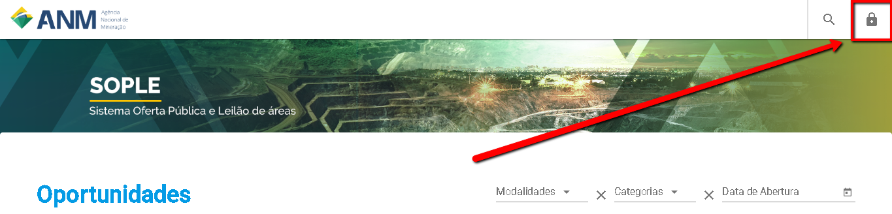
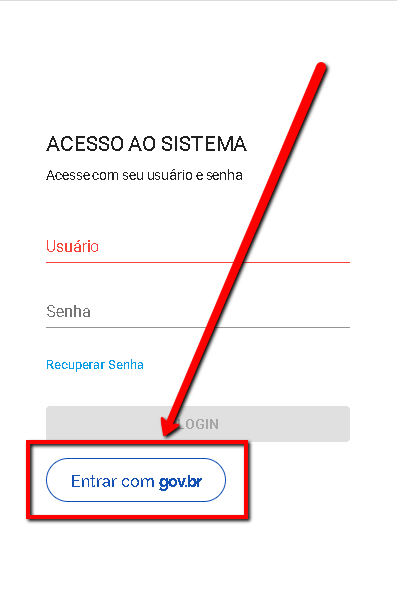

Como acessar o SOPLE?
==========================

Acesse o endereço eletrônico:  https://sople.anm.gov.br

Navegue no Portal Público de Oportunidades para encontrar os editais e as áreas de seu interesse. 
        
Autenticação no SOPLE pode ser feita clicando no "Cadeado", no canto superior direito,
e selecionando a opção "Login ùnico", conforme imagem a seguir. 
    

Clique no cadeado. 

Clique no botão Acesso com GOV.BR.

Quais são os Requisitos Mínimos para acessar o SOPLE? 
===================================

    Utilize os navegadores Chrome ou Firefox em suas versões mais atualizadas;
