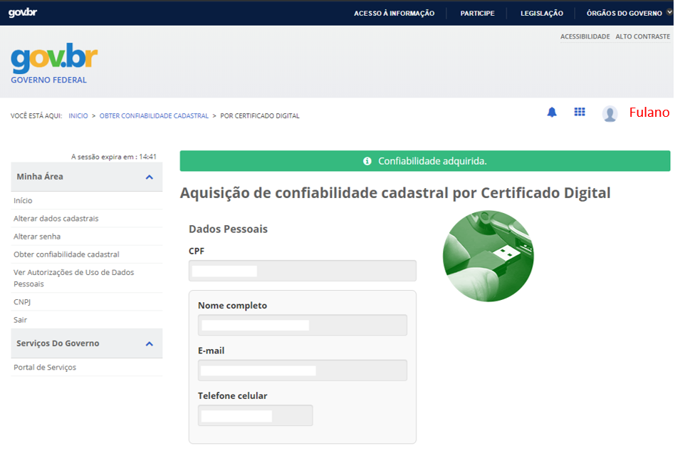

Não tenho cadastro no Login Único (aceso.gov.br). Como devo fazer?
===================================

Passo 1 

Acesse https://acesso.gov.br/ e crie sua conta no Login Único

Passo 2

Obtenha os selos e-CPF ou e-CNPJ, conforme o caso, a partir do respectivo certificado digital.

e-CPF
==================================

Na página de gerenciamento do Login Único, no selo “Cadastro validado por certificado digital” clique em obter e siga as instruções.

.. image:: ../imagens/3.5CadastroECPFNoLoginUnico.png 
Clique no selo “cadastro validado por certificado digital”

Confira os dados e confirme a aquisição de confiabilidade com base no e-CPF

No momento da aquisição do selo e-CPF você deverá estar com o token (pen drive) conectado ao computador ou certificado instalado. Certificados do tipo A1 e A3.

e-CNPJ
==================================

Na página de gerenciamento do Login Único, clique em obter confiabilidade no “e-CNPJ” e siga as instruções.
 	
No momento da aquisição do selo e-CNPJ você deverá estar com o token (pen drive) conectado ao computador ou certificado instalado. Certificados do tipo A1 e A3.
Mais informações sobre o Login Único podem ser obtidas no respectivo FAQ: https://faq-login-unico.servicos.gov.br/en/latest/
