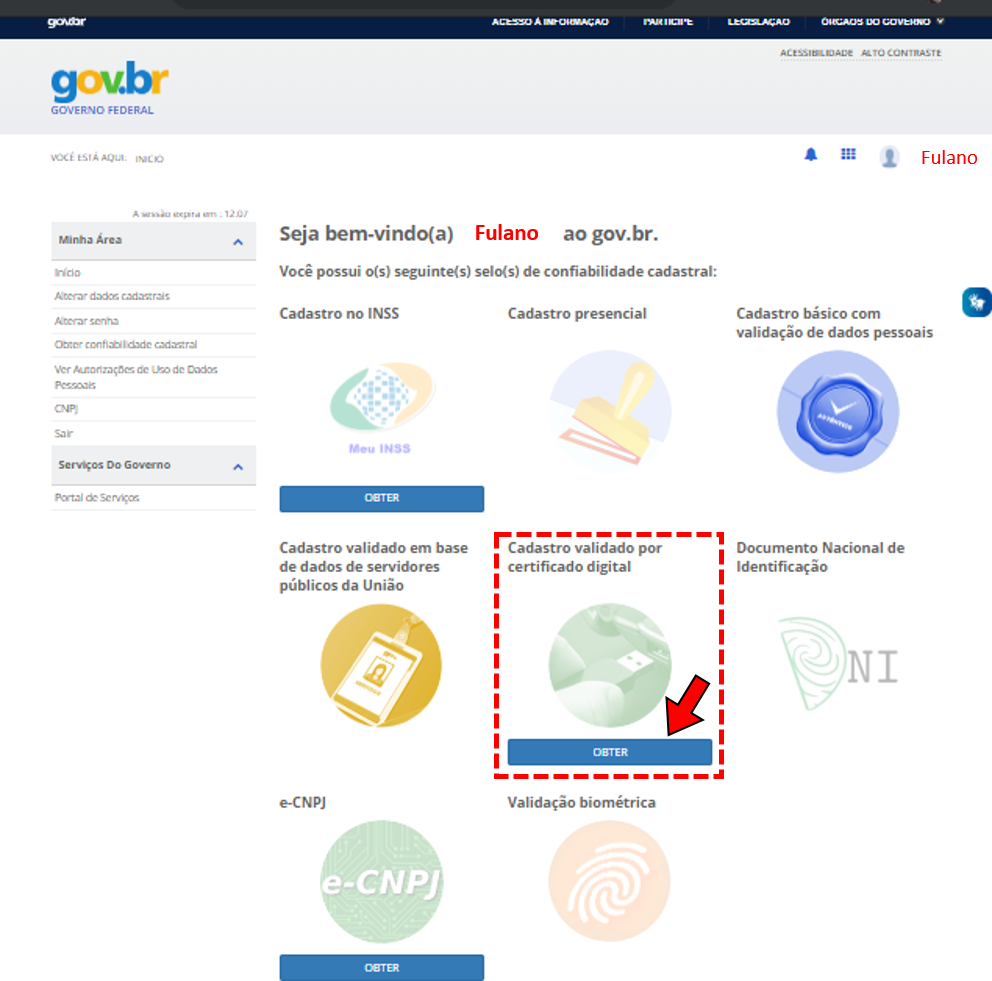

Não tenho cadastro no Login Único (aceso.gov.br). Como devo fazer?
===================================

Passo 1 

Acesse https://acesso.gov.br/ e crie sua conta no Login Único

Passo 2

Obtenha os selos e-CPF ou e-CNPJ, conforme o caso, a partir do respectivo certificado digital.

e-CPF

Na página de gerenciamento do Login Único, no selo “Cadastro validado por certificado digital” clique em obter e siga as instruções.

