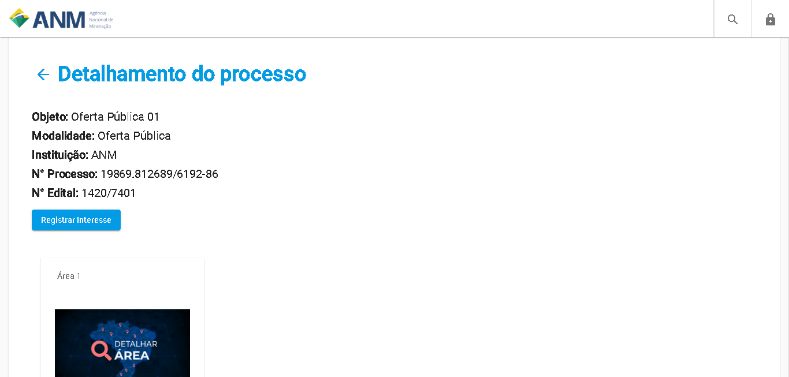

Portal Público - Detalhes do Edital
=============================================

A página de Detalhes do Edital de oferta pública exibe informações básicas do Edital, como Objeto, a Modalidade, o Número do Processo SEI (NUP) e o Número do Edital. 

Além destas informações, são listadas as áreas em Oferta Pública contidas neste edital.
   
Selecionando a imagem de "Detalhar Área" são exibidas as informações da área. 
 

