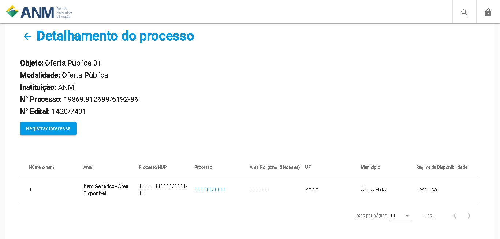

Como ver os Detalhes das Áreas no Portal Público?
=============================================
  
Nesta página são exibidas as informações sobre cada área em Oferta Pública como, Número do Processo (NUP) da área no SEI, Número do Processo Minerário, Área da Poligonal, Estado (UF) e Município na qual a área se encontra e o Regime de Disponibilidade. 

Clicando no Número do Processo Minerário o usuário será redirecionado para a página de Consulta do Cadastro Mineiro, na qual poderá informar o número do processo e consultar mais informações sobre o processo minerário relacionado a esta área. 

