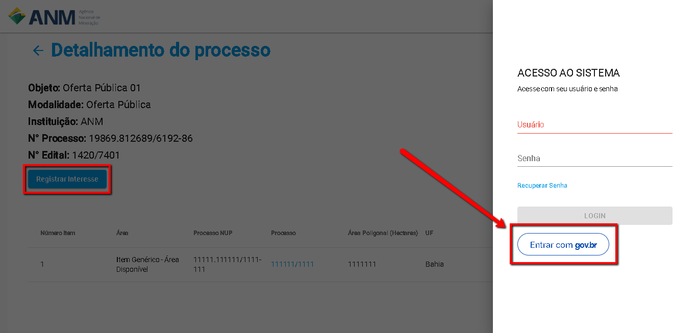
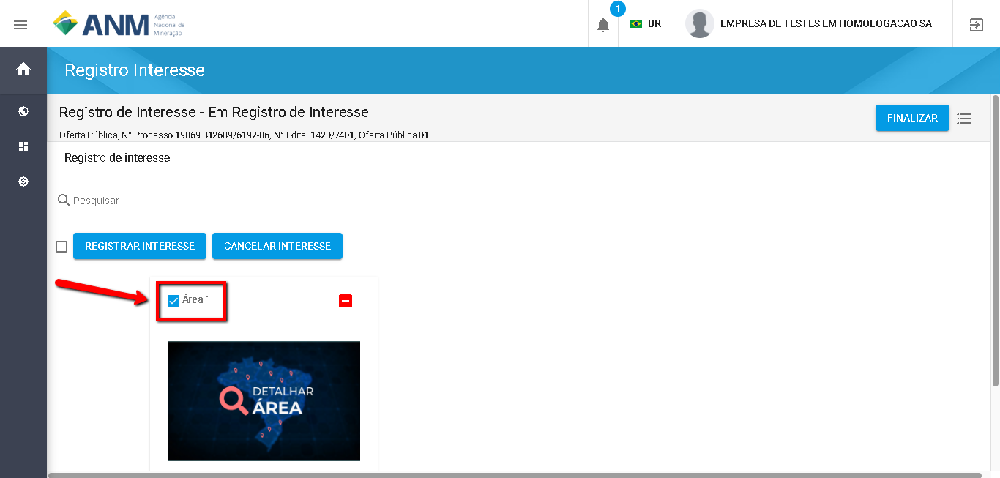
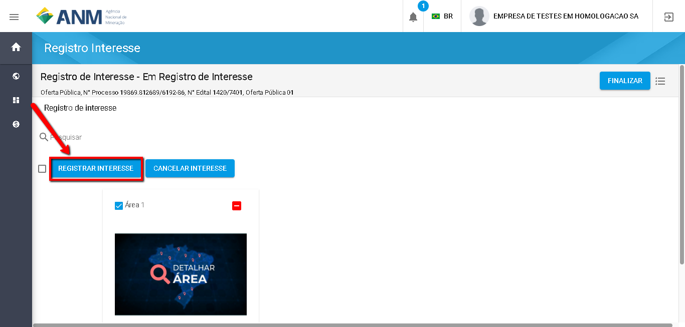
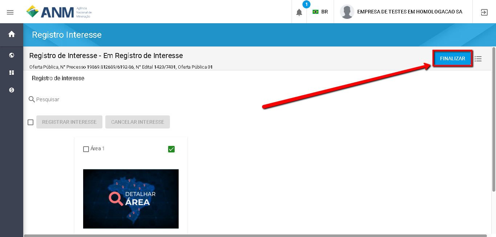

Como Registrar Manifestação de Interesse em Áreas?
=============================================
  
    Na página de Detalhe do Edital ou Detalhe da Área do Portal Público está disponível um botão "Registrar Interesse".  
	
	Ao clicar neste botão será solicitado ao usuário realizar a autenticação (login) no Sistema SOPLE. 
O usuário interessado deve realizar a autenticação no Sistema Escolhendo a opção "ENTRAR COM GOV.BR", conforme imagem abaixo.  
  

   Depois de informar o CPF e senha registrados no GOV.BR, o usuário será redirecionado para a Funcionalidade de Registro de Interesse.
   Nesta página são exibidas as áreas para que o usuário informe selecione as de seu interesse, conforme imagem a seguir.    

   O usuário deve clicar em "Registrar o Interesse" e o sistema registrará a Manifestação de Interesse para todas as áreas selecionadas. 

 
   IMPORTANTE: Após Registrar a Manifestação de Interesse nas áreas o usuário deve clicar em "Finalizar", 
   para Concluir o Registro da Manifestação de Interesse nas áreas Selecionadas. Conforme Imagem abaixo.
  

