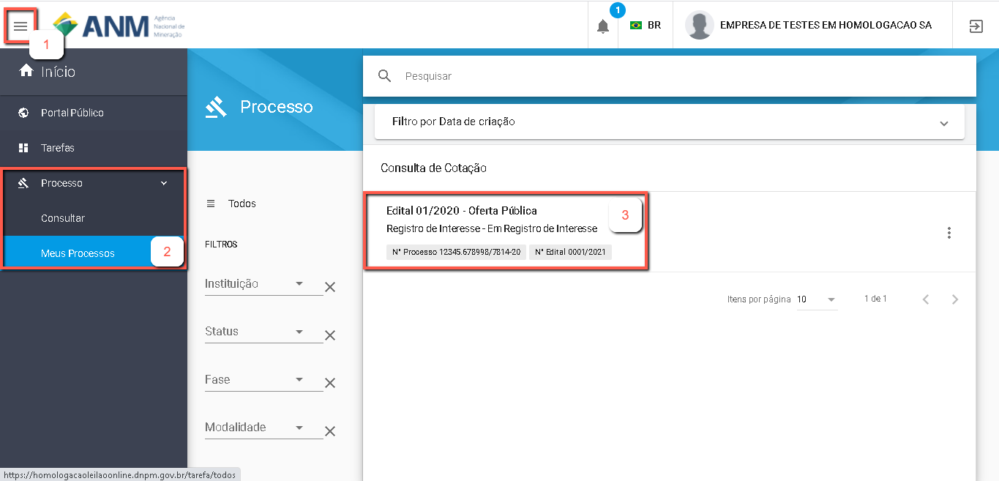
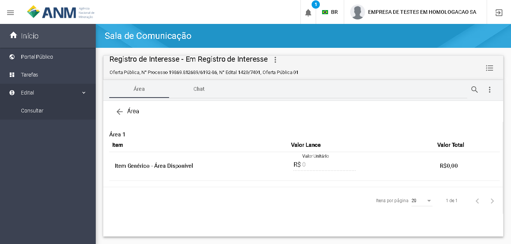

Como consultar Minhas Manifestação de Interesse?
=============================================
    
	A funcionalidade "Minhas Manifestações" exibe a lista de áreas nas quais o usuário autenticado 
tem registro de Manifestação de Interesse Registrado. 

    Seguindo os passos numerados na imagem abaixo o usuário conseguirá visualizar as áreas:
	Item 1: Clique no Icone Superior Esquerdo para abertura do Menu Lateral;
	Item 2: Selecione a opção "Edital" e depois "Consultar";
 	Item 3: Selecione "Minhas Manifestações" no menu intermediário; 
    Item 4: Clique no Menu Direito do Edital, e selecione "Sala de Comunicação".  
	

    Na funcionalidade "Sala de Comunicação", exibida na imagem abaixo, aparecerão a lista de áreas nas quais o usuário já Manifestou Interesse. 

