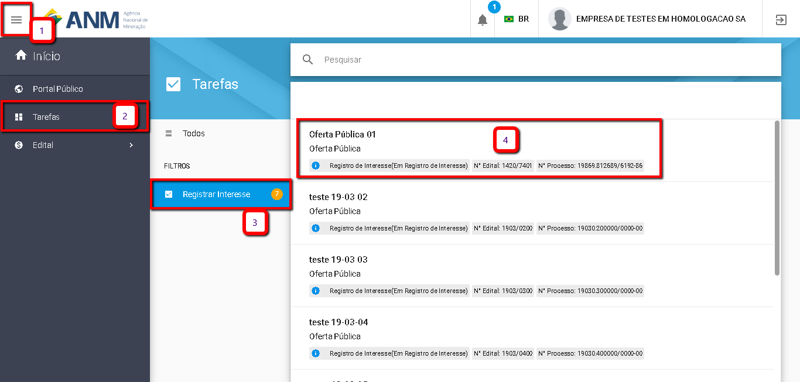
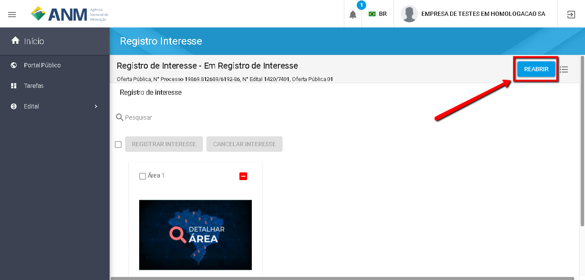

Como Reabrir Minha Manifestação de Interesse?
=============================================

   	A funcionalidade de Reabrir Manifestação de interesse fica disponível após "Finalizar" a Manifestação de Interesse. 
    
	Esta funcionalidade é utilizada nos casos em que o usuário já "Finalizou" a sua Manifestação de Interesse mas deseja alterá-la:
	
	1. Para acrescentar novas áreas de Interesse em sua Manifestação; 
    2. Canadelar a Manifestação de Interesse em alguma área já incluída na Manifestação. 

    Seguindo os passos numerados na imagem abaixo o usuário conseguirá Reabrir sua Manifestação de Interesse:
	
	Item 1: Clique no Icone Superior Esquerdo para abertura do Menu Lateral;
	
	Item 2: Selecione a opção "Tarefas";
 	
	Item 3: Selecione "Registrar Interesse" no menu intermediário; 
    
	Item 4: Selecione o Edital;  

No caso de o usuário já ter finalizado a sua Manifestação de Interesse, o botão "Reabrir" estará visivel para que ele reabra a sua Manifestação de Interesse, conforme imagem abaixo.

