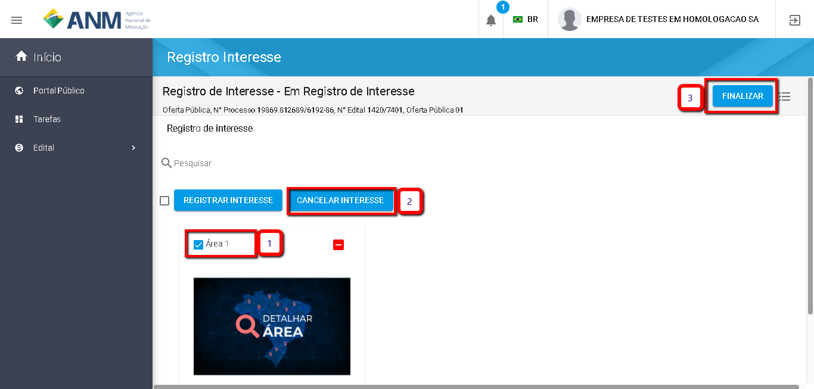

Como Cancelar Minhas Manifestação de Interesse?
=============================================

A funcionalidade "Cancelar" Manifestação de Interesse fica disponível enquanto o usuário não "Finalizar" a Manifestação de Interesse.

Caso o usuário tenha Finalizado a Manifestação de Interesse, faz-se necessário "Reabrir" a Manifestação de Interesse para realizar o cancelamento. 
    
O "Cancelar Manifestação de Interesse" em uma área é utilizado no caso do usuário ter Registrado o Interesse em uma área e deseja retirar (cancelar) a Manifestação de Interesse naquela área ou grupo de áreas, dentro do prazo de Manifestação de Interesse da Oferta Pública.

Seguindo os passos numerados na imagem abaixo o usuário conseguirá Reabrir sua Manifestação de Interesse:
	
	Passo 1: Clique no Icone Superior Esquerdo para abertura do Menu Lateral;
	
	Passo 2: Selecione a opção "Tarefas";
 	
	Passo 3: Selecione "Registrar Interesse" no menu intermediário; 
    
	Passo 4: Selecione o Edital.  
	
Na tela de registro de Interesse (imagem abaixo) siga os passos de 1 a 3:
	
	1. Selecione as áreas nas quais deseja Cancelar a Manifestação de Interesse;
	
	2. Clique em "Cancelar Interesse";
	
	3. Clique em "Finalizar", para finalizar a Manifestação de Interesse e concluir o cancelamento. 
	

