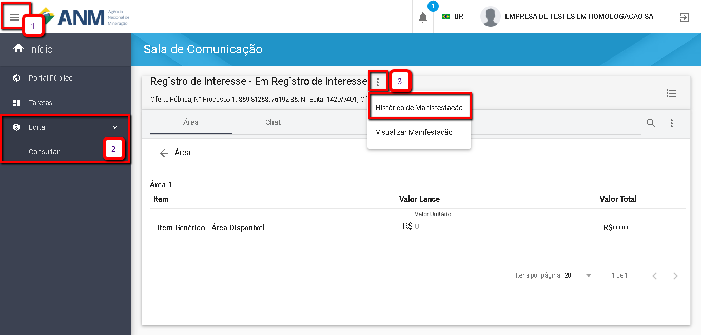
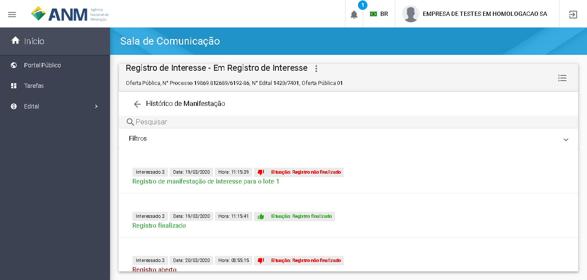

Como visualizar o Histórico das ações de Manifestação de Interesse?
=============================================
  
   O usuário autenticado pode visualizar o "Histórico das Manifestações" de Interesse realizadas por ele seguindo os passos abaixo: 
   
   Item 1: Clique no Menu superior esquerdo;
   
   Item 2: Clique em "Edital" e depois selecione a opção "Consultar"; 
   
   Item 3: Acesse o Menu do Edital e selecione "Sala de Comunicação"; 
   
   Item 3: Clique no Menu superior da Sala de Comunicação e Selecione a opção "Histórico de Manifestações";
  

   A imagem a seguir exibe a funcionalidade "Histórico de Manifestações", a qual exibe todas as ações de Registro e Cancelamento de Manifestações de Interesse realizadas pelo Usuário. 

