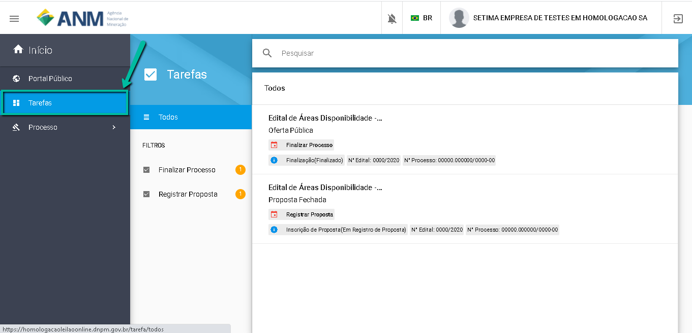
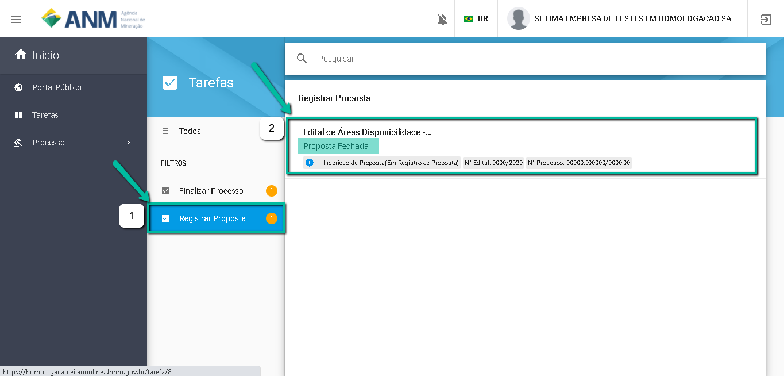

Como Encontrar o Leilão para Fazer a Proposta (Lance) na área?
====================================================

Após autenticar no SOPLE com sua conta do Login Único, escolha o usuário com o qual registrou a Manifestação de Interesse. 

Clique no Menu Tarefas;

Na lista de "Tarefas" são exibidos filtros para Editais em função da ação que o usuário deseja fazer em cada Edital;

No lado direito são exibidos os editais.

Selecione "Registrar Proposta" para filtrar os Editais que se encontram no período de Registro de Proposta. 

Clique no Edital para ir para a Tela de "Inscrição de Proposta". 

