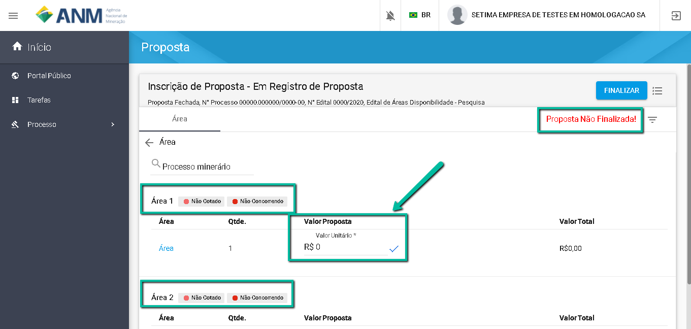
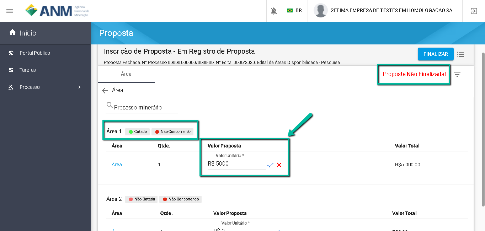
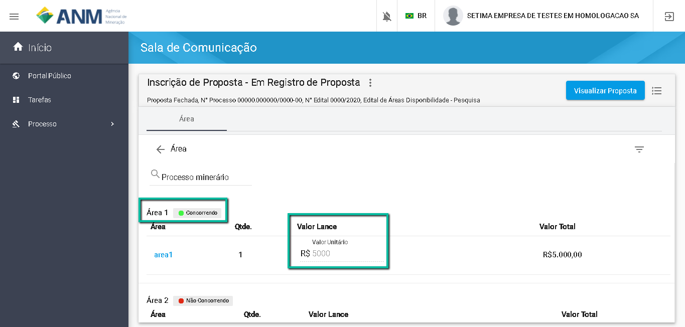

Como Registrar a Proposta para uma Área?
====================================================

Na funcionalidade de "Inscrição de Proposta", no campo "Valor da Proposta", informe o valor da Lance a ser considerado para tentar ganhar o direito de requerer a área com prioridade, conforme as regras do Edital.  

Ao informar o valor da proposta, observe a situação da área "Não Cotado" (em vermelho) mudará para "Cotado" (em verde). 

Após Clicar em "Finalizar", observe que a situação "Não Concorrendo" (em vermelho) mudará para "Concorrendo" (em verde). 

O usuário será redireciondo para a funcionalidade de "Painel de Comunicação", onde poderá acompanhar a situação da sua proposta após o término do prazo de envio de proposta. 

IMPORTANTE: O usuário poderá Inscrever proposta apenas nas áreas em que Manifestou interesse na Fase de Oferta Pública do Edital. 
