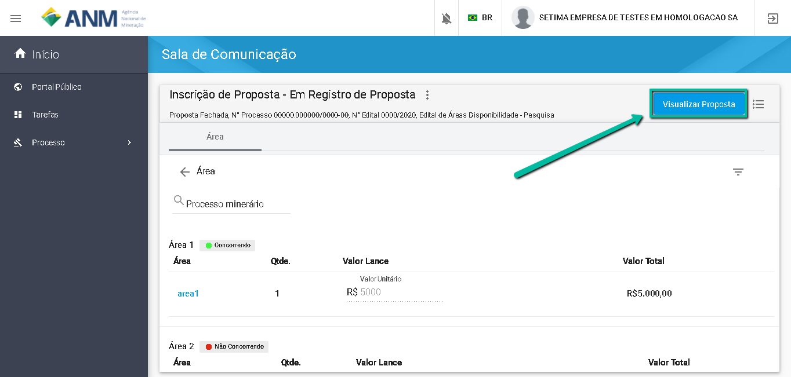
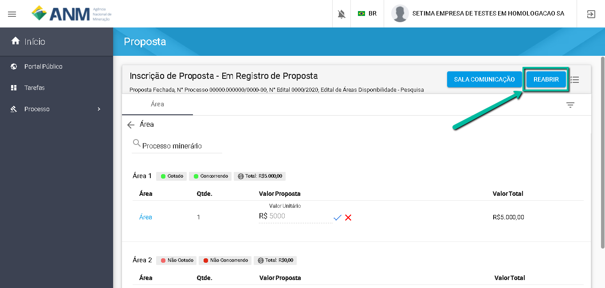

É possível Registrar uma nova Proposta em uma Área?
====================================================

Sim. Basta acessar a tela de inscrição de proposta e informar um novo valor para a sua Proposta. 
Lembre-se de "Finalizar" para garantir a concorrência no processo. 

Caso o usuário já tenha "Finalizado" o envio de suas propostas, é possível reabrir para envio de propostas. 

Para Reabrir selecione "Visualizar Propostas" e depois clicar em "Reabrir", a funcionalidade de "Inscrição de Proposta" será habilitada novamente para envio de nova propsota caso ainda esteja dentro do prazo do Edital. 

IMPORTANTE: 1. O usuário poderá Inscrever proposta apenas nas áreas em que Manifestou interesse na Fase de Oferta Pública do Edital. 
            2. Após reabrir as propostas e fazer as contações, lembre-se de "Finalizar" novamente para que suas propsotas esteja na concorrência do procedimento. 
